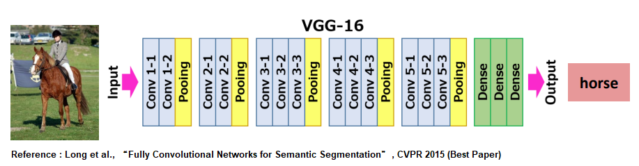
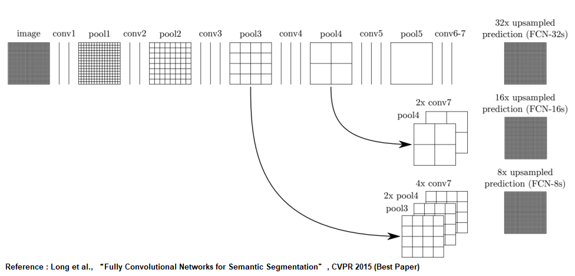
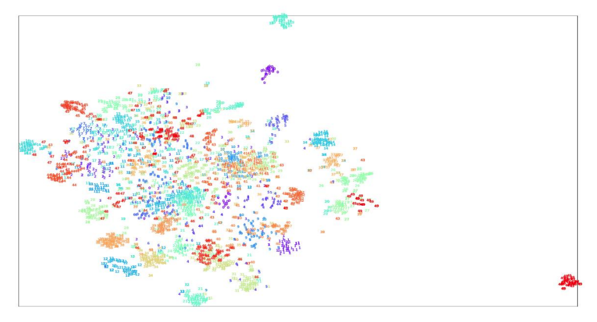

# Deep Learning for Computer Vision HW2
## HW2 Project 1 ― Image Classification
- In project 1, you will need to implement an image classification model and answer some questions in the report.
- Dataset: 25000 colour images with size 32*32 pixels of 50 classes. 22500 images belong to training set. 2500 images belong to validation set.

## HW2 Project 2 ― Semantic Segmentation
- In project 2, you will need to implement two semantic segmentation models and answer some questions in the report.
- Dataset: 2000 satellite images with ground truthes(masks) in training set. 257 images-masks pair in validation set. There are 7 possible classes for each pixel.

## Dataset
- Contact me for Dataset. 
- Email: chengliang.yeh@gmail.com

## Models
- For image classification, I used pre-trained VGG16 as a backbone CNN model to fulfill the task.

- For semantic segmentation, I used VGG16-FCN32s and VGG16-FCN8s to fulfill the task.  

## Evaluation
- To evaluate semantic segmentation model, run the evaluation script by using the following command.

    python3 mean_iou_evaluate.py <--pred PredictionDir> <--labels GroundTruthDir>
    
    `<PredictionDir>` should be the directory to your predicted semantic segmentation map (e.g. `hw2_data/prediction/`)
    
    `<GroundTruthDir>` should be the directory of ground truth (e.g. `hw2_data/val/seg/`)

- Note that your predicted segmentation semantic map file should have the same filename as that of its corresponding ground truth label file (both of extension ``.png``).

## Visualization
- To visualization the ground truth or predicted semantic segmentation map in an image, run the visualization script by using the following command.

    python3 viz_mask.py <--img_path xxxx_sat.jpg> <--seg_path xxxx_mask.png>
    
## Result
### Project 1, tSNE result: 

### Project 2, model predicted masks visualization:
- FCN32s

- FCN8s

### Please check more details in hw2_report.pdf)
## Packages
- This homework should be done using python3.6. Please refer to the requirments.txt for more details about others packages.
- You can run the following command to install all the packages listed in the requirements.txt:

    pip3 install -r requirements.txt

- Note that using packages with different versions will very likely lead to compatibility issues, so make sure that you install the correct version if one is specified above.

## Others
 1.   `hw2_1.sh`  
    The shell script file for running classification model.
 2.   `hw2_2.sh`  
    The shell script file for running baseline semantic segmentation model.
 3.   `hw2_2_best.sh`  
    The shell script file for running improved segmentation model.
 4.   Run code in the following manner:
 
    bash hw2_1.sh $1 $2
    
    where `$1` is the testing images directory (e.g. `test/images/`), and `$2` is the path of folder where you want to output your prediction file (e.g. `test/label_pred/` ).

    bash hw2_2.sh $1 $2
    bash hw2_2_best.sh $1 $2

    where `$1` is the testing images directory (e.g. `test/images/`), and `$2` is the output prediction directory for segmentation maps (e.g. `test/label_pred/` ).

 5.   Trained Models weights will be auto downloaded by shell script file commands. If the dropbox link dead, please contact me. 
